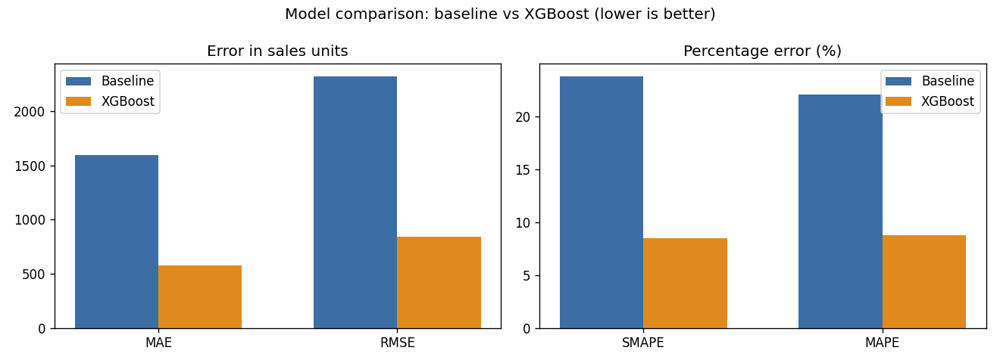
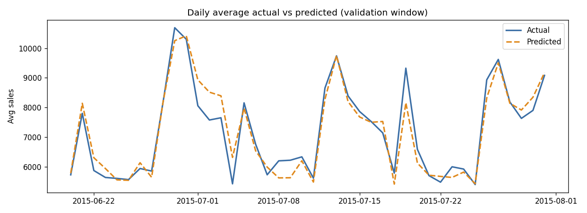
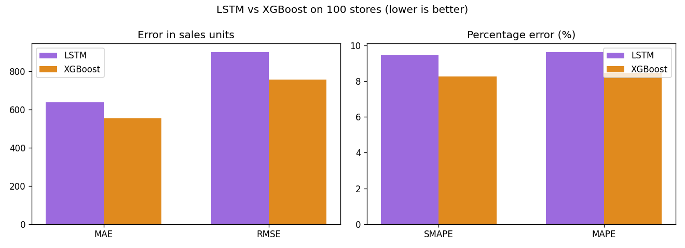
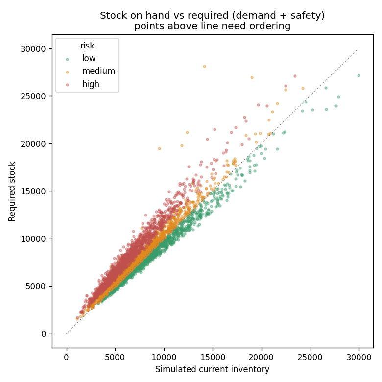

# Retail Sales Forecasting & Inventory Optimization

Forecast daily store sales from historical retail data, then turn those
forecasts into concrete inventory decisions — recommended order quantities with
stockout-risk flags.

> **Portfolio prototype / decision-support project.** This is a realistic
> prototype built to demonstrate an end-to-end data science workflow. It was
> **not** deployed at a company or used in production, and the inventory layer
> uses **simulated** on-hand stock (the public dataset has no inventory data).

---

## Overview

This project answers one business question:

> **"Can we forecast future store sales and use those forecasts to make smarter
> inventory decisions?"**

It takes raw, transaction-level retail data through cleaning, feature
engineering, model training, honest evaluation against a business-rule baseline,
and finally a decision layer that converts forecasts into order recommendations.
Experiments are tracked with MLflow.

## Business problem

Retailers lose money in two directions at once. **Under-stock** and you miss
sales and disappoint customers; **over-stock** and you tie up cash, fill
storage, and risk waste. Both usually come from gu­essing demand. A reliable
short-horizon sales forecast lets a planner order closer to true demand, hold a
sensible safety buffer, and spot the riskiest stores before they stock out.

## Dataset

[Rossmann Store Sales](https://www.kaggle.com/competitions/rossmann-store-sales)
(Kaggle competition data). Two files are used:

- `train.csv` — daily sales per store (the `Sales` target).
- `store.csv` — one row per store (store type, assortment, competition,
  ongoing-promotion metadata).

Scale: **1,017,209** daily rows across **1,115** stores, spanning
**2013-01-01 → 2015-07-31**. `test.csv` is not used because it has no `Sales`
target — validation comes from a strict time-based split of `train.csv`.

The raw CSVs are not committed (Kaggle rules + size); see
[`data/README.md`](data/README.md) for how to download them.

## Project workflow

```
raw CSVs ──► data_prep ──► features ──► modeling ──► inventory
                                  │           │           │
                                  └────────── visualization ──────────► figures
                                              │
                                       mlflow_tracking (optional)
```

1. **Clean & merge** the two files into one time-sorted table.
2. **Engineer features** — calendar signals plus leakage-safe lag/rolling
   history.
3. **Split by time**, train a baseline and XGBoost, and evaluate.
4. **Convert forecasts to orders** with error-based safety stock and risk flags.
5. **Visualize** EDA, evaluation, and inventory results.
6. **Track** the experiment with MLflow (optional).

## Methods used

- **Cleaning:** documented missing-value handling for store metadata; modeling
  restricted to open days with positive sales (closed-day zeros would flatter
  metrics without reflecting real demand).
- **Feature engineering:** `year, month, week, day, day_of_week, is_weekend,
  is_month_start/end`; encoded `StoreType`, `Assortment`, `StateHoliday`; a
  computed `Promo2Active` flag; **lag features** (`sales_lag_7/14/28`) and
  **rolling features** (`rolling_mean/std_7/14/28`) plus a store expanding mean.
- **Leakage control:** every lag/rolling feature is shifted so a row only ever
  sees data from strictly before its own date; the `Customers` column is
  deliberately excluded because it is unknown at forecast time.
- **Validation:** strict time-based split — the final **6 weeks** are held out;
  no random shuffling.

## Models compared

| Model | What it is | Why it's here |
|---|---|---|
| **Baseline** | Predict each day as that store's previous 7-day average | A simple business rule every ML model must beat |
| **XGBoost Regressor** | Gradient-boosted trees on the engineered features | Handles mixed categorical/calendar features, nonlinearities, and interactions with little preprocessing |
| **LSTM (TensorFlow/Keras)** | A sequence model over a 14-day window of sales + promo/calendar | A deep-learning comparison to test whether a temporal model beats the tree model |

**On the LSTM comparison:** a simple Keras LSTM (one LSTM layer over a 14-day
window) was trained and compared head-to-head against XGBoost on an identical
setup — same 100-store subset, same strict time-based split, same validation
store-days. The subset keeps the LSTM tractable on a laptop, and XGBoost is
retrained on that same subset so neither model has a data advantage. On tabular
retail data dominated by calendar and promotion signals, the tree model was the
more accurate and far cheaper choice; the LSTM was competitive but not better
(see results below). See `src/lstm_model.py`.

## Evaluation metrics

- **MAE** — average daily forecast error, in sales units/currency. Most
  intuitive for a stakeholder.
- **RMSE** — like MAE but squares errors, so large misses are penalized more.
- **SMAPE / MAPE** — percentage error, for comparing across stores of different
  sizes.

All metrics are **computed from the validation data at run time** (saved to
`outputs/metrics/metrics.json`); none are hard-coded.

## Key results

> Results below are from the validation run on the last 6 weeks
> (**2015-06-20 → 2015-07-31**; 778,511 training rows, 40,282 validation rows).
> Re-run the pipeline to reproduce; numbers will match unless you change the
> features or parameters.

| Metric | Baseline (7-day avg) | XGBoost |
|---|---:|---:|
| MAE | 1597.34 | **579.05** |
| RMSE | 2323.40 | **840.64** |
| SMAPE | 23.78% | **8.50%** |
| MAPE | 22.04% | **8.74%** |

**XGBoost reduces MAE by ~63.7% versus the baseline** and roughly cuts
percentage error by two-thirds. In plain terms: on unseen recent weeks the
forecast is off by about **580 units/day on average (~8–9%)**, versus ~1,600 for
simply averaging the past week.

**Top features by gain:** `sales_lag_14`, `rolling_mean_28`, `Promo`,
`sales_lag_28`, `rolling_mean_14`. The model leans most on recent sales history
(two-week lag and the 28-day rolling average) and the promotion flag, with
calendar signals (day-of-week, month-end) contributing further down — an
intuitive, defensible ranking.




### LSTM vs XGBoost (controlled comparison on 100 stores)

Both models trained on the same 100-store subset and the same time-based split,
scored on the identical 3,606 validation store-days:

| Metric | LSTM | XGBoost (subset) |
|---|---:|---:|
| MAE | 639 | **554** |
| RMSE | 901 | **757** |
| SMAPE | 9.50% | **8.28%** |
| MAPE | 9.63% | **8.46%** |

The LSTM was competitive (within ~1.2 points of SMAPE) but XGBoost was both more
accurate and far faster to train, so it remains the model put forward. This is
the practical trade-off you make on tabular retail data. (The 8.28% subset figure
differs slightly from the 8.50% full-data figure above because it is computed on
the 100-store subset, not all 1,115 stores.)



## Inventory optimization approach

Forecasts become order recommendations with:

```
recommended_order_quantity = predicted_demand + safety_stock − current_inventory
```

- **predicted_demand** — the XGBoost forecast.
- **safety_stock** — sized from each store's recent forecast error:
  `safety_stock = z × recent_error_std`, with `z` from a target **service level**
  (default 95%, `z ≈ 1.645`). Harder-to-predict stores get larger buffers.
- **current_inventory** — **simulated** for demonstration (clearly prefixed
  `sim_`); the dataset has no real inventory.
- **risk flag** — `high` if stock won't cover expected demand, `medium` if it
  covers demand but not the buffer, `low` if it covers both.

Simulated risk mix at 95% service level: **~27% low / ~40% medium / ~33% high**.



This is a **decision-support prototype**, not a supply-chain system.

## Repository structure

```
retail-sales-forecasting-inventory/
├── README.md
├── requirements.txt
├── .gitignore
├── data/                 # raw CSVs go here (gitignored); see data/README.md
├── notebooks/
│   └── 01_retail_sales_forecasting.ipynb
├── src/
│   ├── data_prep.py      # load, inspect, clean, merge
│   ├── features.py       # calendar + leakage-safe lag/rolling features
│   ├── modeling.py       # time split, baseline, XGBoost, metrics
│   ├── lstm_model.py     # Keras LSTM, fair head-to-head vs XGBoost
│   ├── inventory.py      # forecast → safety stock → order recommendation
│   ├── visualization.py  # all EDA / evaluation / inventory charts
│   └── mlflow_tracking.py# optional experiment tracking
├── outputs/
│   ├── figures/          # saved charts (committed so they render here)
│   ├── metrics/          # metrics.json
│   └── predictions/      # validation + inventory tables
└── reports/
    └── project_summary.md
```

## How to run

```bash
# 1. Environment
python3.11 -m venv .venv && source .venv/bin/activate   # Windows: py -3.11 -m venv .venv; .\.venv\Scripts\activate
pip install -r requirements.txt

# 2. Data — place train.csv and store.csv in data/ (see data/README.md)

# 3. Pipeline (run in order)
python src/data_prep.py        # -> data/clean_merged.parquet
python src/features.py         # -> data/features.parquet
python src/modeling.py         # -> metrics, predictions, feature_importance, model
python src/inventory.py        # -> inventory recommendations
python src/visualization.py    # -> all charts in outputs/figures/

# 4. Optional: deep-learning comparison (LSTM vs XGBoost)
pip install tensorflow         # or tensorflow-cpu (lighter, no GPU needed)
python src/lstm_model.py       # -> lstm_metrics.json, lstm_vs_xgb.png
# quicker trial: LSTM_N_STORES=30 LSTM_EPOCHS=8 python src/lstm_model.py

# 5. Optional experiment tracking
python src/mlflow_tracking.py
mlflow ui --backend-store-uri sqlite:///mlflow.db   # then open http://127.0.0.1:5000
```

Runs comfortably on a normal laptop; XGBoost training takes roughly 1–3 minutes.

## Limitations

- **Simulated inventory.** On-hand stock is generated, so the order quantities
  illustrate the *logic*, not real decisions.
- **Safety stock estimated on the validation window.** Fine for a prototype, but
  production should use a rolling trailing error and live inventory positions.
- **Rolling features include closed-day zeros**, which slightly depress the
  rolling means. The definition is consistent at train and predict time (so it
  is not leakage), but computing rolling stats over open days only is cleaner.
- **One global model**, raw-scale target, default-ish parameters — no
  per-store models, log-transform, or extensive tuning yet.
- **No external signals** (weather, local events, competitor changes).

## Future improvements

- Hyperparameter tuning and a `log1p(Sales)` target to optimize percentage error.
- Rolling features computed over open days only.
- A deeper / tuned LSTM trained on all stores, to see if it can close the gap.
- Quantile forecasts to size safety stock directly from prediction intervals.
- Real inventory + lead-time data to replace the simulated layer.
- Backtesting across multiple rolling validation windows.

## Note on scope

This is a personal portfolio project built to demonstrate an end-to-end
forecasting and decision-support workflow on public data. Figures and metrics
come from the code in this repository; the inventory layer is an illustrative
prototype with simulated stock levels.